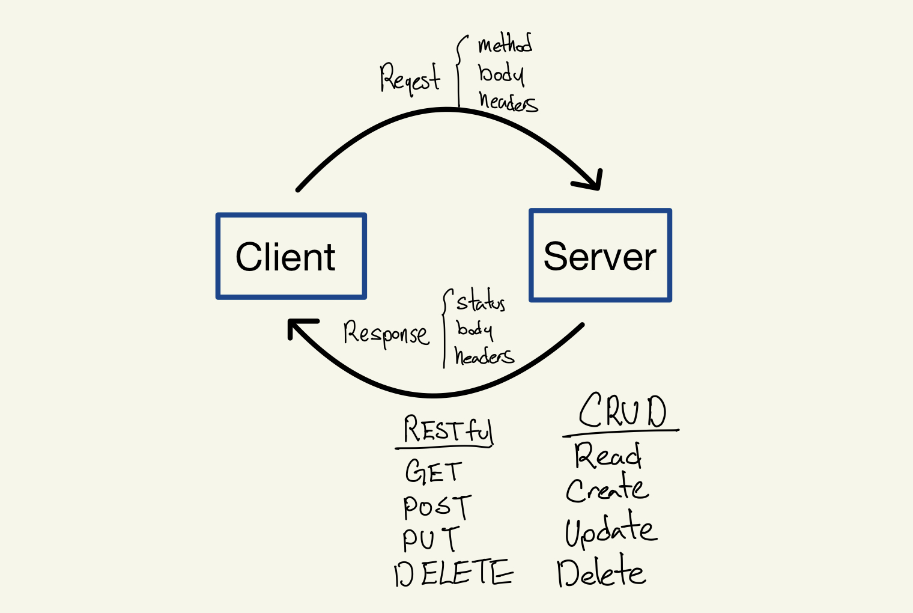

# LAB - Basic API Server

### Author: Ellis Yoo

### Links and Resources

- [ci/cd](https://github.com/yjyoo773/basic-api-server/actions)
- [back-end server url](https://ellis-basic-api-server.herokuapp.com/)

### Setup
#### How to initialize/run your application (where applicable)
- Dependencies
  - dotenv
  - express
  - jest
  - supertest
- Application is initialized by `npm start`
- Application can run using nodemon by `npm run dev-start`

#### Tests

- How do you run tests?   
  By running `npm test` on the terminal, application will run 9 tests total.   
- Any tests of note?  
  First checking on the route giving a false route it tests to give a 404 status and a incorrect method to an existing route to give a 404 status.  
  The second part of the test is testing POST GET PUT DELETE.  
  1. Creates a mock data and checks for the correct status and if the created data is correct. 
  2. Reads created data checking the entire database and also the individual data within. Also, checking for the correct status and information
  3. Update the created data and check for the correct status and the correctly updated data.
  4. Delete the data and check for the correct data. Read the data to make sure the data no longer exists.
- Describe any tests that you did not complete, skipped, etc
  The `logger.test.js` was used from the provided demo code. 
  
#### UML / Application Wiring Diagram

